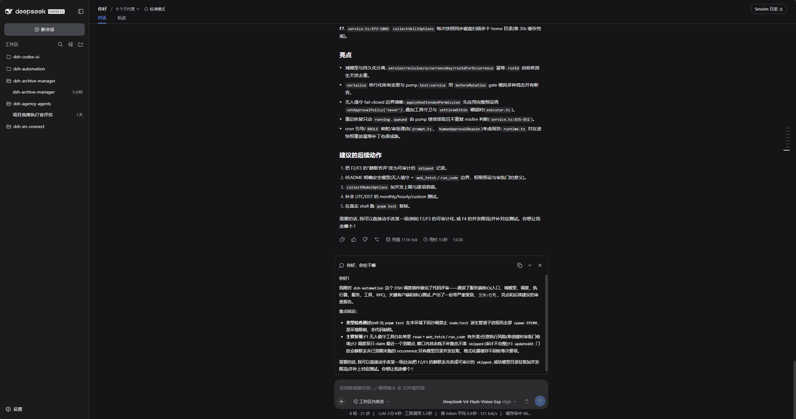
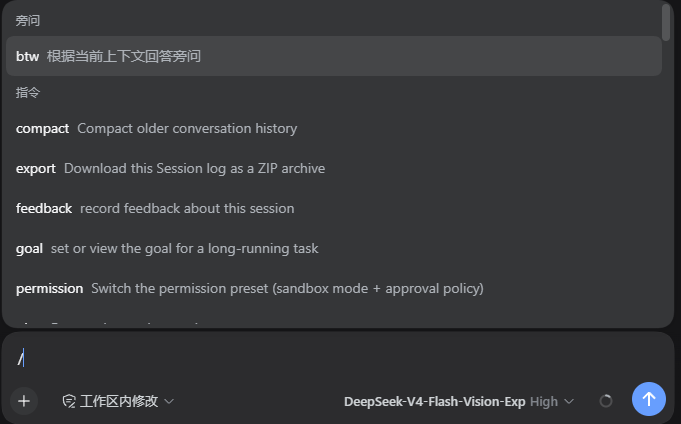
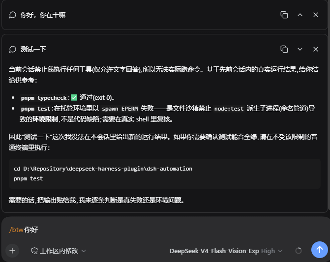

<div align="center">

# DSH BTW

**在 DeepSeek Harness 当前会话中随手旁问，只回答，不执行**

[English](README.md) · [界面预览](#界面预览) · [安装](#安装) · [使用](#使用) · [更新日志](CHANGELOG.zh-CN.md) · [Apache-2.0](LICENSE)

[](LICENSE)
[](https://github.com/deepseek-ai/deepseek-harness)
[](https://nodejs.org/)

</div>

在原有聊天输入框输入 `/btw 问题`，根据当前会话的已有上下文获取回答。答案显示在输入框上方的独立气泡中，方便临时解释概念、回顾结论或追问原因。

DSH BTW 是社区维护的 DSH Web 插件，也可用于承载 Web 客户端的桌面容器。不占用侧边栏，不依赖 Codex UI，无需打开独立页面。

## 功能概览

- **上下文旁问**：每次提问创建一次性子代理，继承主会话已完成回合。
- **只回答，不执行**：禁用全部工具，不读取新文件、联网、运行命令或修改代码。
- **独立答案气泡**：支持 Markdown、复制、折叠、展开和关闭，可同时查看多条旁问。
- **主任务保持独立**：答案不回填主模型历史，上一条旁问也不会成为下一条的上下文。
- **取消与清理**：关闭运行中的气泡只取消对应旁问；清理失败时保留提示，支持再次关闭。
- **主题与国际化**：跟随 DSH 浅色、深色主题，界面支持中文和英文切换。

## 界面预览

以下为用户提供的实际 DSH 深色界面截图，图中模型回答仅用于展示气泡效果。

### 原生 DSH 中的旁问

主会话保留在原来的位置，旁问答案位于输入框上方。



### 命令入口

输入 `/` 后，可在「旁问」分类中选择 `btw`，也可以直接输入 `/btw 问题`。



### 独立答案气泡

每条旁问单独展示，右上角提供复制、折叠或展开、关闭操作。



## 前置条件

- 已能正常使用 DeepSeek Harness Web，并且可在 PowerShell 中执行 `dsh`。
- 开发基线为 DSH `0.1.2-rc.1`，宿主需要支持继承上下文的 `fork` 子代理、工具过滤及 persona。
- 从源码构建需要 Node.js 22+ 和 npm。
- 以下命令使用 `web` profile，请按实际环境替换。

## 安装

支持从 npm、本地源码或构建包安装。

源码仓库：<https://github.com/MichengAI/dsh-btw>。也可从 [Releases](https://github.com/MichengAI/dsh-btw/releases) 下载 `.tgz` 安装包。

### 从 npm 安装

```powershell
[Console]::OutputEncoding = [System.Text.Encoding]::UTF8
$OutputEncoding = [System.Text.Encoding]::UTF8

dsh plugin --profile web add @michengai/dsh-btw@latest --registry=https://registry.npmjs.org/
dsh --profile web --dump-config
```

将 `@latest` 替换为 `@0.1.0` 可固定首个版本。安装后按下文说明重新加载 DSH。

### 从本地源码安装

在本项目根目录执行：

```powershell
[Console]::OutputEncoding = [System.Text.Encoding]::UTF8
$OutputEncoding = [System.Text.Encoding]::UTF8

npm ci --ignore-scripts
npm run build
dsh plugin --profile web add . --ignore-scripts
dsh --profile web --dump-config
```

检查配置中是否包含 `michengai-btw`。本地目录安装会读取包信息和 `cordis.patch.yml`，无需手工复制 `lib`。

### 从安装包安装

在本项目根目录执行 `npm pack` 生成安装包，然后安装：

```powershell
[Console]::OutputEncoding = [System.Text.Encoding]::UTF8
$OutputEncoding = [System.Text.Encoding]::UTF8
npm pack
dsh plugin --profile web add .\michengai-dsh-btw-0.1.0.tgz --ignore-scripts
dsh --profile web --dump-config
```

已有 `.tgz` 文件时，直接将安装命令中的路径替换为该文件路径。安装前停用其他占用 `/btw` 的插件。

### 重新加载

DSH Codex Desktop 可能在检测到插件变更后自动重载服务，请在当前任务结束后安装或更新。其他 DSH Web 启动方式需要自行重启。

本地开发链接的 JS 重新构建不等于后端已经重载。当前宿主的 `patchReload: live` 仅监听配置，后端 HMR 的 `root: []` 不监听插件 JS；前端可能已出现新文案，后端仍运行旧命令目录。升级后须等任务结束，重新加载实际使用的后端：桌面版使用其“重新加载”，独立 `dsh web` 则重启该命令对应的进程。仅刷新浏览器不能更新后端。

## 使用

在已有上下文的会话中输入：

```text
/btw 刚才这个方案为什么采用一次性子代理？
```

| 目标 | 操作 |
| --- | --- |
| 提一个旁问 | 输入 `/btw 问题` 并提交，或从 `/` 菜单选择 `btw`。 |
| 查看答案 | 等待输入框上方的独立气泡返回回答。 |
| 复制答案 | 点击气泡右上角的复制图标。 |
| 收起或展开 | 点击气泡右上角的折叠或展开图标。 |
| 取消旁问 | 在回答过程中关闭对应气泡，不取消主任务。 |
| 移除答案 | 关闭已完成的气泡。 |
| 继续提问 | 再次输入 `/btw 问题`；每次都是独立旁问。 |

若需要执行命令、修改代码或继续主任务，请通过普通会话提交。BTW 只能依据已有上下文作答。

上下键输入历史已迁至 Codex UI。本插件不再采集输入历史、访问历史存储或绑定上下键；单独安装只提供 BTW 旁问。

## 兼容与边界

开发基线为 DSH `0.1.2-rc.1`。需要宿主装配 commands、tools、subagents 及 fork provider，且 provider 必须支持工具过滤、persona 与上下文继承；缺少能力时拒绝启动。客户端需要 conversation、input-trigger、chat、api-remotes、locale 模块及宿主主题令牌。

子代理使用空工具白名单，并由执行层 guard 拒绝全部工具，包括 `run_code` 和子作用域自注册工具。

fork 继承的是已完成回合，主任务正在生成的回合不包含在内。一次性子代理的释放不等于删除宿主的审计日志。命令结果不加入主模型历史，但宿主仍可保存命令及子代理记录。

内部传输命令为 `btw-run` 和 `btw-close`，从命令目录中隐藏；用户只需使用 `/btw` 和气泡关闭按钮。它们使用宿主会话 RPC，未增加 HTTP 接口。

`btw-run` 的 JSON 请求为 `{ id, question, locale? }`，`locale` 支持 `zh`、`en`，省略时兼容旧客户端按中文处理；其他语言回退英文。返回仍为宿主命令的 `{ kind, text }`。`btw-close` 继续接受原始请求标识，清理错误保留该请求的语言。

单次问题最多 8000 字符、90 秒超时、最多同时处理 8 个请求。

气泡仅保存在客户端内存中，刷新页面后不恢复。外观跟随 DSH 当前主题，不单独读取系统深色偏好。界面语言通过宿主 locale 服务即时切换，服务器提示使用提交时的语言；模型回答和外部原始错误不翻译。

本机安装状态和待验收事项统一记录在[当前状态](docs/00-交接入口/02-当前状态.md)，运行时与模拟宿主测试不能代替实际 DSH 的模型和交互验收。

## 卸载

```powershell
[Console]::OutputEncoding = [System.Text.Encoding]::UTF8
$OutputEncoding = [System.Text.Encoding]::UTF8

dsh plugin --profile web remove @michengai/dsh-btw
```

重新加载 DSH 后生效。停用或升级不会删除主会话记录。

## 本地开发

```powershell
[Console]::OutputEncoding = [System.Text.Encoding]::UTF8
$OutputEncoding = [System.Text.Encoding]::UTF8
npm ci --ignore-scripts
npm run check
```

`npm run check` 执行类型检查、单元测试和构建。`npm run dev` 仅提供开发用模拟宿主，回答为模拟数据，不连接真实模型；实际使用入口始终是 DSH。主题 CSS 和 LocaleRuntime 来自同版本官方开发依赖。

运行 `npm run test:browser` 验证气泡、取消、窄屏、Markdown、主题切换、对比度、语言切换及不再拦截上下键。

浏览器测试需要先构建，Playwright 自动管理 `npm run dev`，本地默认使用已安装的 Microsoft Edge，CI 使用 Chromium。`tests/host.test.ts` 从 `DSH_RUNTIME_ROOT` 指定的 `node_modules` 读取宿主；默认读取用户目录下 `.dsh/profiles/node_modules`，不存在时明确跳过这 2 项测试，不会读取凭据或配置。CI 指向本项目开发依赖，实际执行运行时用例。

`tests/command-visibility.test.ts` 使用真实 Typert Registry、Gateway 和命令运行时验证 RPC 目录、执行及卸载恢复；同时检查本机可用的桌面运行时，其目录可用 `DSH_DESKTOP_RUNTIME_ROOT` 覆盖。通过该测试仍需确认运行中的 DSH 已重新加载构建产物。

## 参考与致谢

参考 [JasonQQ/dsh-btw-plugin](https://github.com/JasonQQ/dsh-btw-plugin) 的旁问交互、[kaieye/dsh-AIR](https://github.com/kaieye/dsh-AIR) 的关闭流程，以及下述 Pi 插件的边界处理，代码独立实现。

参考 [`@narumitw/pi-btw` 0.57.0](https://pi.dev/packages/@narumitw/pi-btw) 的 [源码](https://github.com/narumiruna/pi-extensions/tree/b4981b29604945d67ce2ce04e0f769c62bce1f20/packages/pi-btw)：

- 将旁问上下文限定为提问时的快照，避免跟随主任务持续变动。本插件通过 fork 继承已完成回合。
- 取消后再次检查信号，拒收迟到答案。本插件前后端都按请求标识检查取消状态。
- 默认不回填主任务。本插件只展示独立气泡，不绑定历史导航按键。

Pi 使用无工具的直接模型调用；本插件仍按约定使用一次性子代理。未引入其全屏 TUI、多轮恢复或回填主任务功能。

## 项目文档

- [阅读导航](docs/00-交接入口/00-阅读导航.md)
- [当前状态](docs/00-交接入口/02-当前状态.md)
- [待办与阻塞](docs/00-交接入口/03-待办与阻塞.md)
- [自动测试与发布](docs/05-工程交付/01-自动发布.md)

## 许可证

[Apache-2.0](LICENSE) © 2026 MichengAI。
